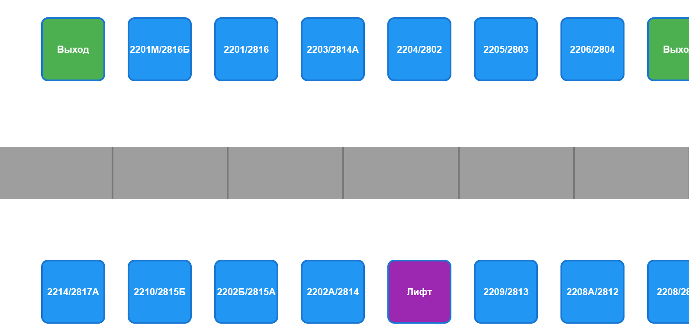
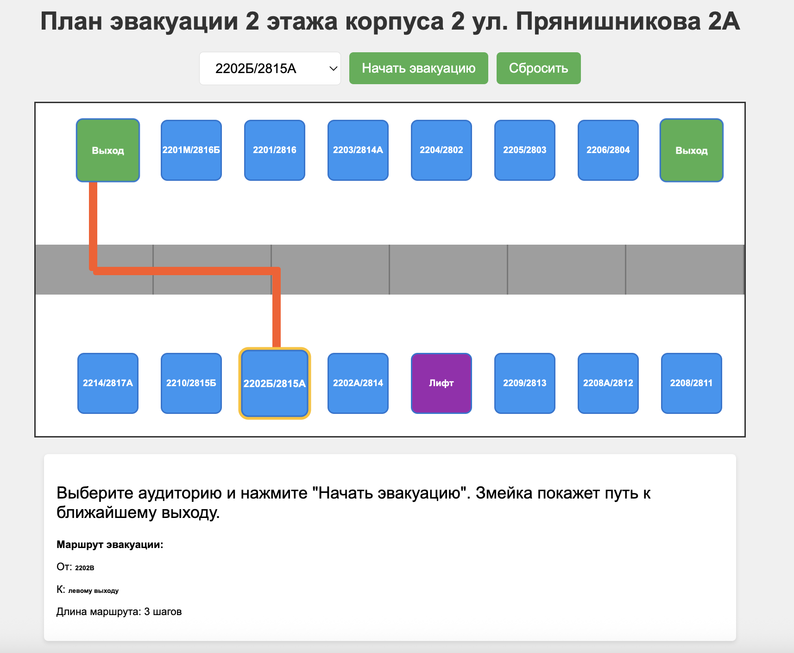

# Интерактивный план эвакуации на основе игры "Змейка"

## 1. Исследование предметной области

### Этапы исследования:
1. **Анализ планировки здания**:
   - Изучение поэтажных планов корпуса МосПолитеха (ул. Прянишникова, 2А)
   - Выделение ключевых элементов: аудитории, коридоры, выходы, лифты, санузлы
   - Пример: 

2. **Определение алгоритма эвакуации**:
   - Составление графа смежности помещений
   - Тестирование маршрутов через алгоритм поиска кратчайшего пути (BFS)
   - Визуализация: 

3. **Прототипирование интерфейса**:
   - Создание интерактивной карты с CSS-позиционированием элементов
   - Реализация анимации движения "змейки" по маршруту

## 2. Полное техническое руководство

### 2.1 Системные требования
- **Минимальные требования**:
  - Браузер: Chrome 90+, Firefox 88+, Edge 90+
  - Текстовый редактор: VS Code
  - Node.js v14+

### 2.2 Пошаговая установка
```bash
# Клонирование репозитория
git clone https://github.com/paladijmaxim/practice-2025-Paladii-Rebrova.git
cd PRACTICE-2025-PALADII-REBROVA

# Установка зависимостей
npm install

# Запуск сервера разработки
npm run dev

## 3. Примеры кода

### 3.1 построение графа связи между помещениями
```javascript
const graph = {
    'exit1': ['corridor-0'],
    'exit2': ['corridor-5'],
    '2201M': ['corridor-0'],
    '2201': ['corridor-0'],
    '2203': ['corridor-1'],
    '2204': ['corridor-2'],
    '2205': ['corridor-3'],
    '2206': ['corridor-4'],
    '2214': ['corridor-0'],
    '2210': ['corridor-0'],
    '2202B': ['corridor-1'],
    '2202A': ['corridor-1'],
    'elevator': ['corridor-2'],
    '2209': ['corridor-3'],
    '2208A': ['corridor-4'],
    '2208': ['corridor-4'],
    '2207': ['corridor-5'],
    'toilet': ['corridor-5'],
    'corridor-0': ['exit1', '2201M', '2201', '2214', '2210', 'corridor-1'],
    'corridor-1': ['corridor-0', '2203', '2202B', '2202A', 'corridor-2'],
    'corridor-2': ['corridor-1', '2204', 'elevator', 'corridor-3'],
    'corridor-3': ['corridor-2', '2205', '2209', 'corridor-4'],
    'corridor-4': ['corridor-3', '2206', '2208A', '2208', 'corridor-5'],
    'corridor-5': ['corridor-4', '2207', 'toilet', 'exit2']
};
```
### 3.2 Реализация алгоритма BFS
```javascript
function findShortestPath(start, end) {
    const queue = [[start]];
    const visited = new Set([start]);

    while (queue.length > 0) {
        const path = queue.shift();
        const node = path[path.length - 1];

        if (node === end) return path;

        (graph[node] || []).forEach(neighbor => {
            if (!visited.has(neighbor)) {
                visited.add(neighbor);
                queue.push([...path, neighbor]);
            }
        });
    }

    return null;
}
```
### 3.3 визуализация маршрута (анимация движения "змейки")
```javascript
function animateSnake() {
    if (currentStep >= currentPath.length * 10) {
        cancelAnimationFrame(animationFrame);
        return;
    }

    const progress = currentStep / (currentPath.length * 10);
    const pathIndex = Math.floor(progress * (currentPath.length - 1));
    const segmentProgress = (progress * (currentPath.length - 1)) % 1;

    const current = roomPositions[currentPath[pathIndex]];
    const next = roomPositions[currentPath[pathIndex + 1]];
    
    if (current && next) {
        const head = snakeSegments[snakeSegments.length - 1];
        head.style.left = `${current.x + (next.x - current.x) * segmentProgress - 7.5}px`;
        head.style.top = `${current.y + (next.y - current.y) * segmentProgress - 7.5}px`;
    }

    // Подсветка пройденного пути
    for (let i = 0; i < snakeSegments.length - 1; i++) {
        if (i < pathIndex) {
            snakeSegments[i].style.opacity = '1';
        }
    }

    currentStep++;
    animationFrame = requestAnimationFrame(animateSnake);
}
```
